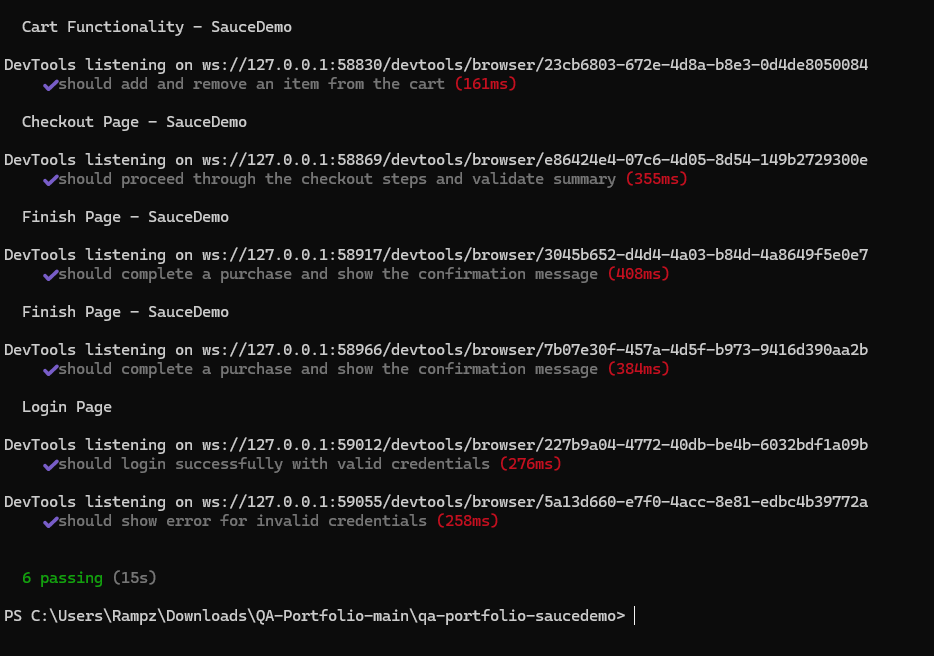

# QA Automation Portfolio - SauceDemo - Selenium WebDriver

</img>

This project is a complete automation test suite using **Selenium** and **Javascript**, targeting the [SauceDemo](https://www.saucedemo.com) e-commerce demo site.

## 🧪 Tech Stack
- **Language**: JavaScript
- **Framework**: Mocha (with Chai for assertions)
- **Automation Tool**: Selenium WebDriver

## 📁 Structure
```
├── helpers/            # WebDriver setup
├── pages/              # Page Object Model
├── tests/              # All automated tests
├── .gitignore
├── package.json
└── README.md
```

## ✅ What is tested?
| Area        | Scenarios |
|-------------|-----------|
| **Login**   | Valid & invalid login attempts |
| **Inventory** | Product listing visibility |
| **Cart**    | Add and remove items from cart |
| **Checkout**| Enter user info and complete checkout |
| **Finish**  | Confirmation message validation |

## 🚀 How to Run
1. Clone the repo
2. Install dependencies:
   ```bash
   npm install
   ```
3. Run the tests:
   ```bash
   npm test
   ```

> Make sure Chrome is installed and in your system path.---

QA is love, QA is life. 💙
